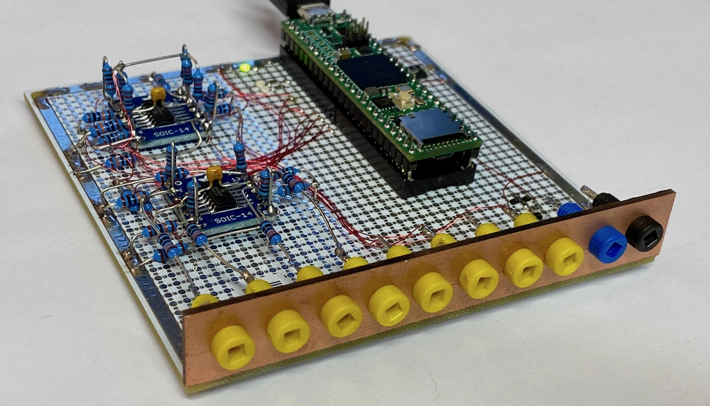
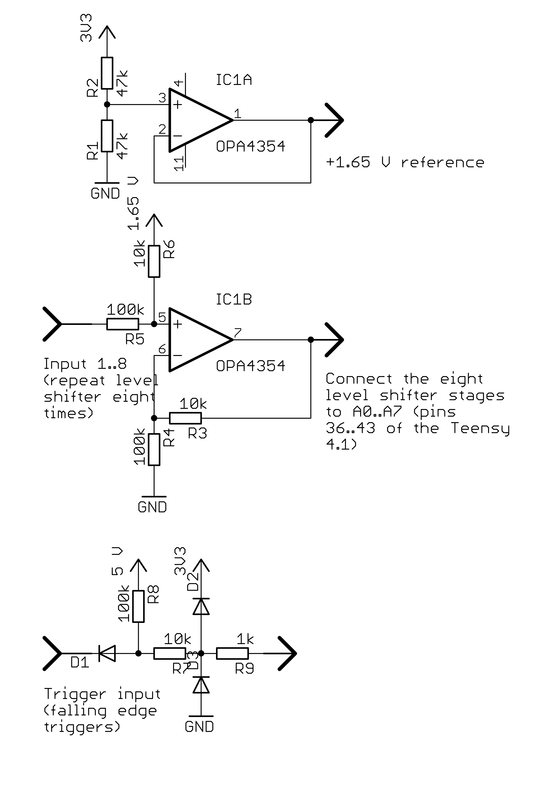

# TeensyLogger
This repository holds all code and schematics for a simple eight channel
data logger based on a Teensy 4.1. This was developed with analog computing
in mind but can be used for basically anything requiring not more than eight
channels and ideally having a TTL trigger signal available.

## Hardware
The TeensyLogger is a very simple eight channel data recorder based on a
Teensy 4.1 as shown below:

The overall setup is pretty simple and consists of a Teensy 4.1 (which was
at hand when I built it - other Teensy variants might be more suitable as
some of these feature an external reference voltage input which the 4.1 is
missing), eight simple level shifters which map an input signal ranging
between +15 V and -15 V to the permissible input range of 0 .. 3V3 of the 
Teensy itself. These level shifters require a common reference voltage 
which is derived by a voltage divider followed by a buffer amplifier. The
last part of the schematic shown below is the protection circuit for the 
trigger input. The TeensyLogger will start gathering data on a falling edge
of the trigger input and stop data collection at the next rising edge.

## Firmware
The firmware for the TeensyLogger is written in C++ using the Teensyduino
IDE and can be found here: [Firmware](TeensyLogger)

The firmware can be used either manually by connecting a terminal application
to the USB port of the TeensyLogger or by using the Perl module TeensyLogger.pm
described below.

The following commands are implemented in the firmware:

- ?: Print help.
- arm: Arm the TeensyLogger for data sampling which will commence either when
       an external trigger signal is fed to the TeensyLogger or if the start
       command (see below) is issued.
- benchmark: This will perform 1000 AD conversions and return the time 
       required for a single conversion of a given number of input channels.
- channels=x: This command is used to set the number of channels to be sampled.
       Valid values of x are in the interval 1 to 8.
- dump: Dump all data gathered during a sampling period to the USB port. The
       values are printed as floating point numbers in the interval -1..1,
       with individual channels delimited by whitespace.
- interval=x: Set the sampling interval to x microseconds (it should not be 
       set to a value lower than that returned by executing the benchmark
       command to avoid data loss during sampling).
- ms=x: Set the maximum number of sampling points to x. When x is reached 
       during a data gathering operation, sampling is automatically stopped.
- reset: Reset the TeensyLogger to its default settings (one channel, no
       oversampling, 1000 microseconds sampling interval).
- sample: Perform a single sampling operation on all configured channels.
- oversampling=x: If values must be smoothed, this can be done by 
       oversampling i.e. reading multiple times from each channel and then
       computing the arithmetic mean over these conversion results. The value
       x is interpreted as exponent of 2 ** x i.e. x=0 results in no 
       oversampling and is the default setting. To perform four consecutive
       reads on each channel during each sampling operating x=2 should be
       set. Please note that oversampling slows the sampling process down 
       quite considerably and also leads to a larger phase error between 
       the individual channels, so it should be used with caution if at all.
- start: Start data gathering. This will end either when the stop command
       is issued or when the maximum number of samples is reached.
- status: Print the current system status.
- stop: Stop the current data gathering operation (or disarm the TeensyLogger
       if it has been armed but not yet triggered).

## Perl module TeensyLogger
The Perl module [TeensyLogger](TeensyLogger.pm) implements a simple object 
oriented interface to the TeensyLogger.

-   [NAME](#NAME)
-   [VERSION](#VERSION)
-   [SYNOPSIS](#SYNOPSIS)
-   [DESCRIPTION](#DESCRIPTION)
-   [Function and methods](#Function-and-methods)
    -   [new(port =\> 'port name', timeout =\> timeout in
        milliseconds)](#new-port-port-name-timeout-timeout-in-milliseconds)
    -   [arm()](#arm)
    -   [benchmark()](#benchmark)
    -   [get\_data()](#get_data)
    -   [plot(title =\> '...', terminal =\> '...', output =\> '...',
        yrange =\> '...', xrange = '...', columns =\> '..., ...,
        ...')](#plot-title-...-terminal-...-output-...-yrange-...-xrange-...-columns)
    -   [reset()](#reset)
    -   [sample()](#sample)
    -   [set\_channels(value)](#set_channels-value)
    -   [set\_interval(value)](#set_interval-value)
    -   [set\_oversampling(value)](#set_oversampling-value)
    -   [set\_max\_samples(value)](#set_max_samples-value)
    -   [status()](#status)
    -   [start()](#start)
    -   [stop()](#stop)
    -   [store\_data(filename =\> '...', delimiter =\> '...', header =\>
        '...')](#store_data-filename-...-delimiter-...-header)
    -   [get\_response()](#get_response)

NAME {#NAME}
====

TeensyLogger - Perl interface to a simple Teensy 4.1 based data logger.

VERSION {#VERSION}
=======

This document refers to version 0.1 of TeensyLogger

SYNOPSIS {#SYNOPSIS}
========

The module can be used as follows:

        use strict;
        use warnings;

        use lib '.';
        use TeensyLogger;
        use Data::Dumper;

        # Create a new data logger object:
        my $logger = TeensyLogger->new(port => '/dev/cu.usbmodem90408601', timeout => 1100);

        $logger->set_channels(8);           # Set number of channels to 8
        $logger->set_interval(1000);        # Set sampling interval to 1000 microseconds

        print Dumper($logger->status());    # Get status information
        print Dumper($logger->benchmark()); # Benchmark how long one sample will take

        $logger->arm();                     # Prepare for data gathering
        $logger->start();                   # If no external trigger is available, start gathering
        ...
        $logger->stop();                    # Stop data gathering if no external trigger was used
        ...
        $logger->sample();                  # Perform one sampling operation

        my $data = $logger->get_data();     # Read all data gathered so far. The result is 
                                            # an array of arrays.
        print scalar(@$data), " samples read\n";

        # Store data gathered into a file:
        $logger->store_data(filename => 'test.dat', delimiter => ',');

        $logger->reset();                   # Reset the data logger to its initial configuration

DESCRIPTION {#DESCRIPTION}
===========

This module implements a simple object oriented interface to the Teensy
4.1 based eight channel data logger. This data logger was developed for
use with analog and hybrid computers but can be used in any environment
featuring signal levels between -10 V and +10 V (+/-15 V being the
absolute permitted maximum).

Function and methods {#Function-and-methods}
====================

new(port =\> 'port name', timeout =\> timeout in milliseconds) {#new-port-port-name-timeout-timeout-in-milliseconds}
--------------------------------------------------------------

This function generates a new TeensyLogger object. It requires the
specification of the USB port to be used to communicate with the device.
If a timeout value is omitted, a default communications timeout of 1
second is assumed.

arm()
-----

The method arm() arms the data logger so that it will start data
gathering when either told so explicitly by calling the method start()
or by an external trigger signal which should be the default case.

benchmark()
-----------

The benchmark() method performs a sampling benchmark based on the number
of channels currently configured and returns a reference to a hash which
in turn contains the keys 'time' and 'channels'. The time-entry contains
the number of microseconds required for a single sample operation while
'channel' returns the number of channels which were used for this
particular benchmark run.

get\_data()
-----------

The get\_data() method reads data from the data logger and returns a
reference to an array containing array references.

plot(title =\> '...', terminal =\> '...', output =\> '...', yrange =\> '...', xrange = '...', columns =\> '..., ..., ...') {#plot-title-...-terminal-...-output-...-yrange-...-xrange-...-columns}
--------------------------------------------------------------------------------------------------------------------------

plot() uses gnuplot (which must be installed and be found in the path
variable!) to plot data previously gathered. All parameters are
optional:

title can be used to specify the title of the overall plot.

terminal may be used to specify a specific output terminal such as xterm
or postscript.

output can be used to direct the gnuplot output into a file.

yrange and xrange expect an argument like '[100:200]' and limit the
yrange/xrange of the plot.

columns expects a comma separated string like '..., ..., ...'. The
individual entries are used to label the plot lines in the output graph.
If no column names are specified the respective input channel numbers (1
.. 8) will be used instead.

reset()
-------

Calling the reset() method resets the data logger to its initial
configuration with respect to the number of channels, sampling interval
etc.

sample()
--------

The sample() method performs a single sampling operation.

set\_channels(value) {#set_channels-value}
--------------------

set\_channels(value) sets the number of channels to be sampled. The
number of channels must be greater than zero and less or equal to eight.

set\_interval(value) {#set_interval-value}
--------------------

Calling set\_interval(value) sets the interval between two consecutive
samples to the specified value in microseconds.

set\_oversampling(value) {#set_oversampling-value}
------------------------

Typically, the data logger samples every data point once. To smooth the
resulting data, it can be configured to perform oversampling by calling
this method once. The value specified is interpreted as exponent of 2,
i.e. calling set\_oversampling(2) will result in 2 \*\* 2 = 4 samples
being read per data point which are then averaged to give the actual
data point. Note that oversampling slows down the data sampling
considerably and also introduces increased delay between successive
channels. Thus it should be used with caution!

set\_max\_samples(value) {#set_max_samples-value}
------------------------

Using the method set\_max\_samples(...) it is possible to limit the
maximum number of samples taken by the data logger. The value must be,
of course, greater than zero.

status()
--------

The method status() returns a reference to a hash containing the current
status and configuration settings of the data logger.

start()
-------

Calling start() will start data logging. This method should not be used
under normal circumstances as an external trigger signal allows for much
tighter timing control.

stop()
------

The stop() method stops a currently running data logging operation or
disarms the data logger if no previous trigger signal has been received
or start() has not been called prior to this. It returns a character
string which will be either "Stopped" or "Disarmed" depending on the
state of the data logger.

store\_data(filename =\> '...', delimiter =\> '...', header =\> '...') {#store_data-filename-...-delimiter-...-header}
----------------------------------------------------------------------

Calling store\_data(...) stores all data gathered so far in a file which
name is specified as the filename. The optional parameter 'delimiter'
can be used to specify a user defined delimiter character sequence. The
default delimiter character is ';'. If the optional header-argument is
specified, its value character string will be written as header line to
the data file.

store\_data(...) requires that get\_data() has been called before!

get\_response()
---------------

The method get\_response() waits for a response (a single line) from the
Teensy 4.1 based data logger. It is normally used only by the routines
of this module. The response is returned as a character string.

